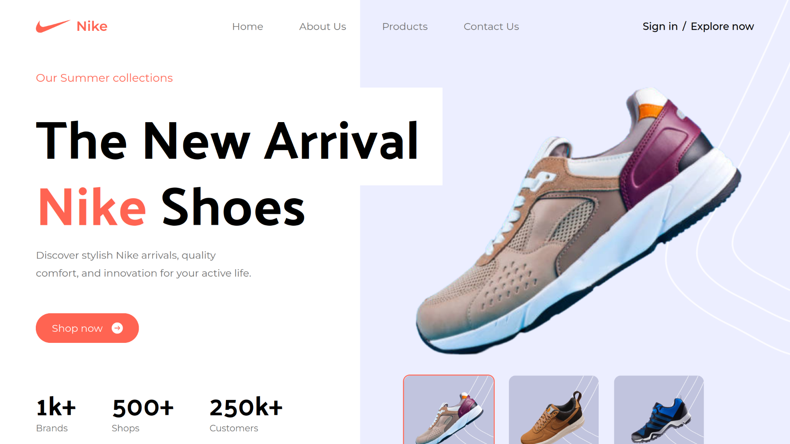
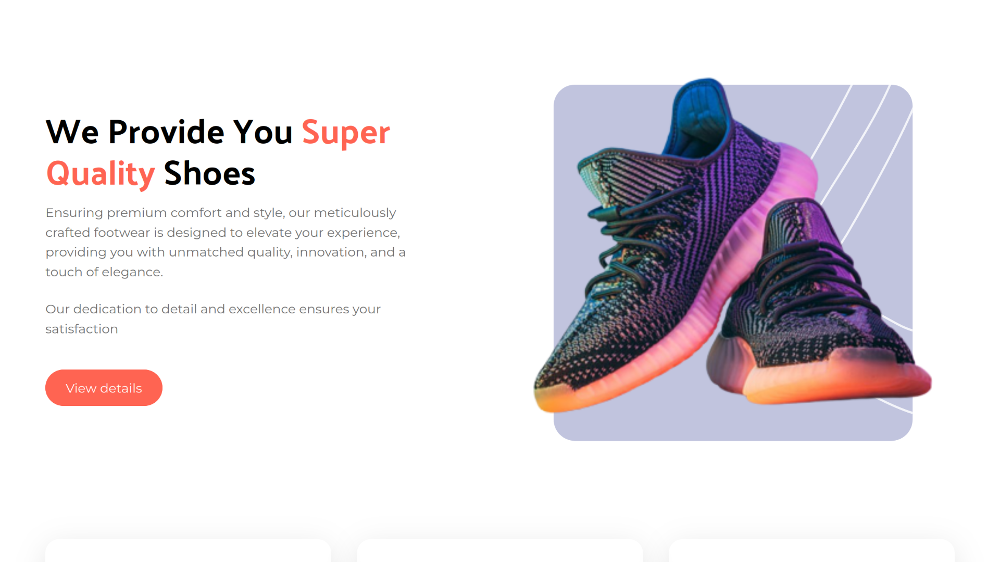
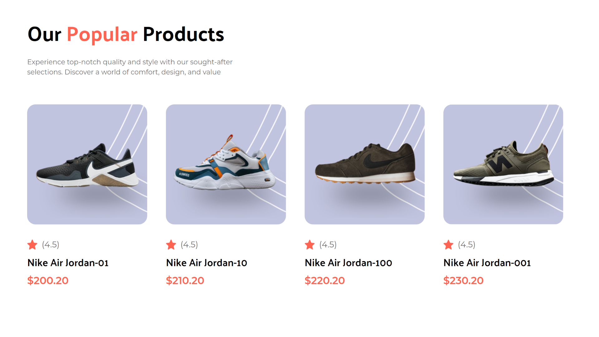
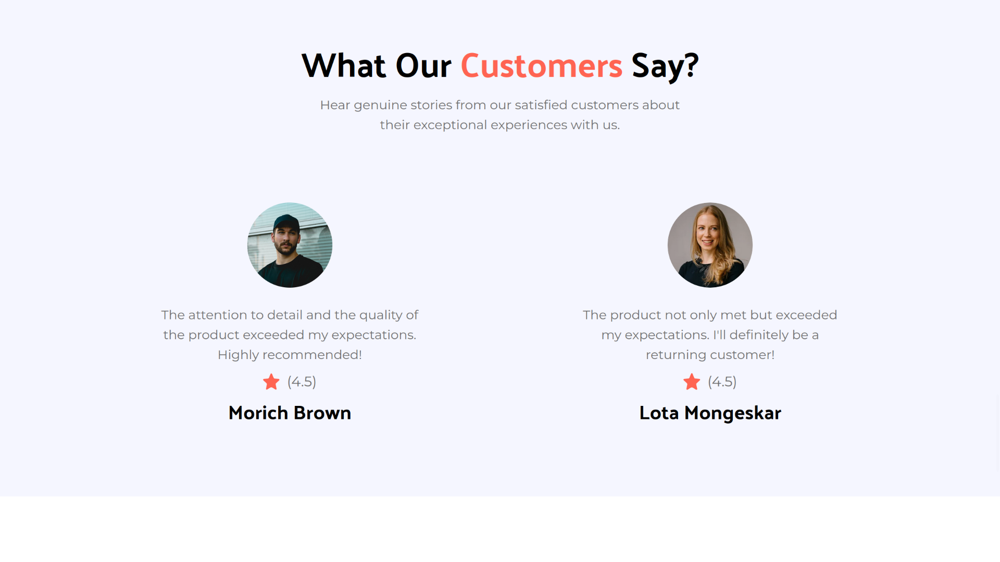
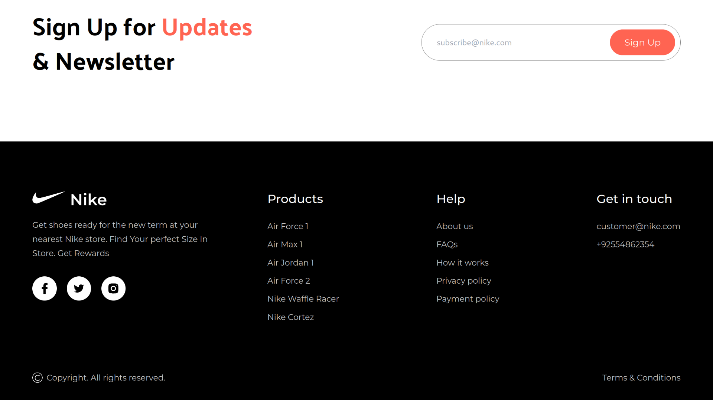

# 🚀 **Nike Clone: A Stunning Front-End Masterpiece**  

Welcome to the **Nike Clone** – a meticulously crafted front-end web application that brings the iconic Nike experience to life! This project is a testament to modern web development, showcasing sleek design, seamless functionality, and a responsive user experience. Built with **Tailwind CSS** and **React.js**, this clone is not just a replica; it’s a showcase of creativity, technical expertise, and attention to detail.  

Whether you're looking for a developer who can deliver pixel-perfect designs or someone who understands the nuances of user experience, this project demonstrates my ability to bring your vision to reality. Let’s create something extraordinary together!  

---
## 📸 **Project Preview**

Here are some snapshots of the Nike Clone project to give you a visual taste of what’s in store:

---
## ⚙️ **Tech Stack**  

- **Tailwind CSS**: For lightning-fast, utility-first styling that ensures clean, maintainable, and scalable code.  
- **React.js**: To build dynamic, reusable components that deliver a smooth and interactive user experience.  

This powerful combination ensures a modern, efficient, and visually stunning web application.  

---

## 🔥 **What Makes This Project Stand Out?**  

Here’s why this Nike Clone is more than just a project – it’s a showcase of my skills and dedication:  

### 🌟 **Pixel-Perfect Design**  
- A visually striking and modern UI that mirrors the elegance of the Nike brand.  
- Every element is crafted with precision to ensure a cohesive and professional look.  

### 🚀 **Seamless User Experience**  
- Smooth navigation and intuitive interactions that keep users engaged.  
- A focus on usability and accessibility to cater to a wide audience.  

### 📱 **Fully Responsive**  
- Flawless responsiveness across all devices – from desktops to tablets and mobiles.  
- Tailwind CSS’s mobile-first approach ensures a consistent experience everywhere.  

### 🎨 **Dynamic Features**  
- **Hero Section**: A captivating hero section that sets the tone for the website.  
- **Product Showcase**: Highlight popular Nike products in a sleek, user-friendly layout.  
- **Special Offers**: Eye-catching sections to display promotions and deals.  
- **Testimonials**: A beautifully designed testimonials section to build trust and credibility.  
- **Newsletter Integration**: A stylish newsletter section to boost user engagement.  
- **Comprehensive Footer**: A detailed footer with essential links and information.  

### 🛠️ **Clean & Scalable Code**  
- Well-structured, reusable components for easy maintenance and scalability.  
- Best practices in Tailwind CSS and React.js ensure efficient and future-proof code.  

---

## 💡 **Why This Project?**  

This Nike Clone isn’t just a demonstration of technical skills – it’s a reflection of my passion for creating beautiful, functional, and user-centric web applications. Here’s what I bring to the table:  

- **Attention to Detail**: Every pixel, every interaction, and every line of code is crafted with care.  
- **Modern Design Sensibility**: A deep understanding of what makes a website visually appealing and engaging.  
- **Technical Expertise**: Proficiency in cutting-edge tools like Tailwind CSS and React.js to deliver high-quality results.  
- **Client-Centric Approach**: A commitment to understanding your needs and delivering solutions that exceed expectations.  

---

## 🌐 **Let’s Build Something Amazing Together**  

If you’re looking for a developer who can turn your ideas into reality, let’s connect! This project is just a glimpse of what I can do. Whether it’s a sleek e-commerce platform, a dynamic web application, or a custom solution tailored to your needs, I’m ready to bring your vision to life.  

📩 **Get in touch today**, and let’s create something extraordinary!  

--- 

**Built with passion, precision, and a commitment to excellence.**  
Let’s make your next project unforgettable! 🚀